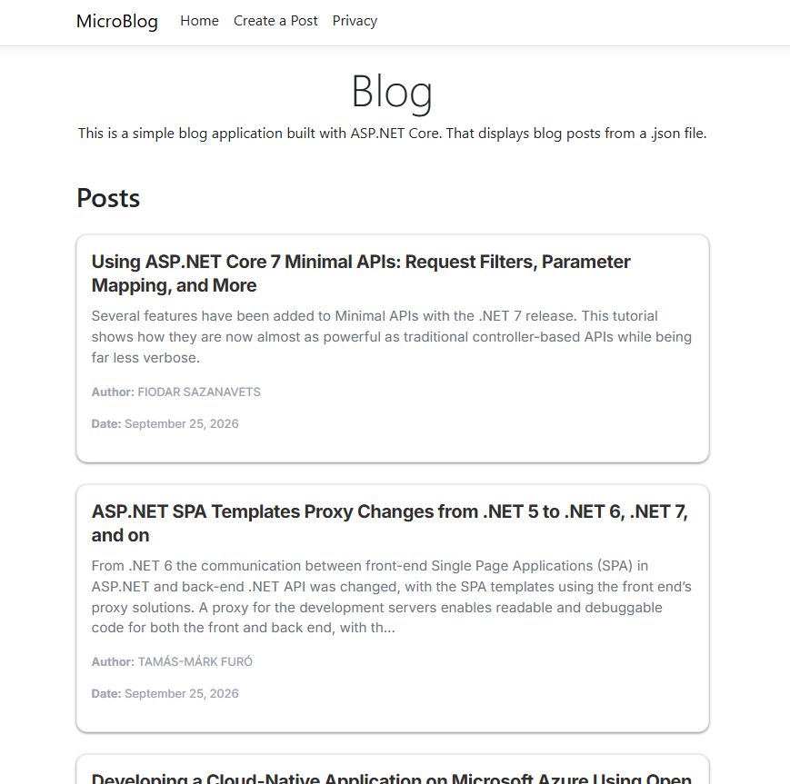
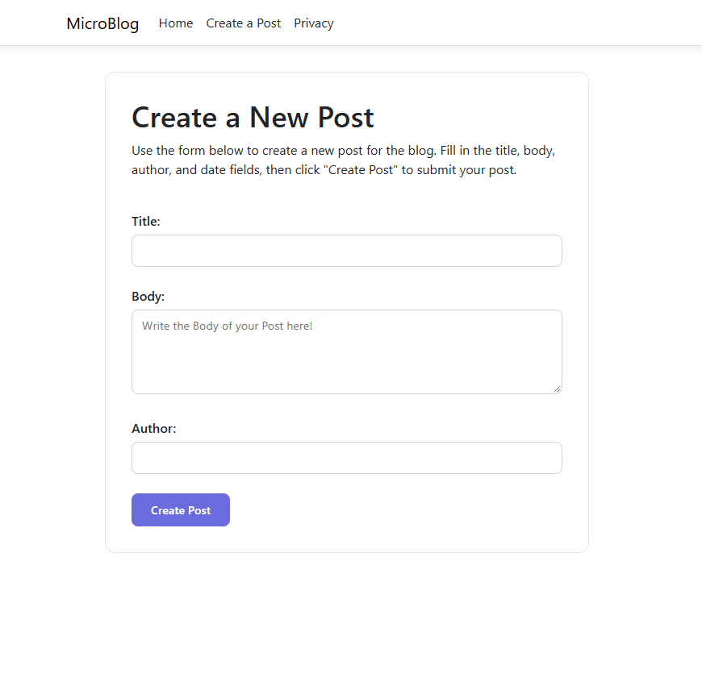
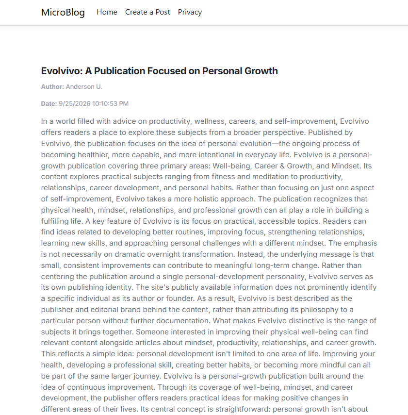

# MicroBlog

A simple ASP.NET Core Razor Pages blog application.
The application allows users to create, view, and manage blog posts stored in a JSON file.

## Features

* Create new blog posts
* View post summaries
* View full post details
* Store posts in `data/posts.json`
* Automatic post IDs and creation dates
* Reusable `_PostCard` partial

## Getting Started

* Clone the repository:

```bash
git clone
```

* Navigate to the project directory:

```bash
cd MicroBlog
```

* Build the project:

```bash
dotnet build
```

* Run the project:

```bash
dotnet run
```

## Screenshot

### Home-Page


### Form-Page


### Details-Page
